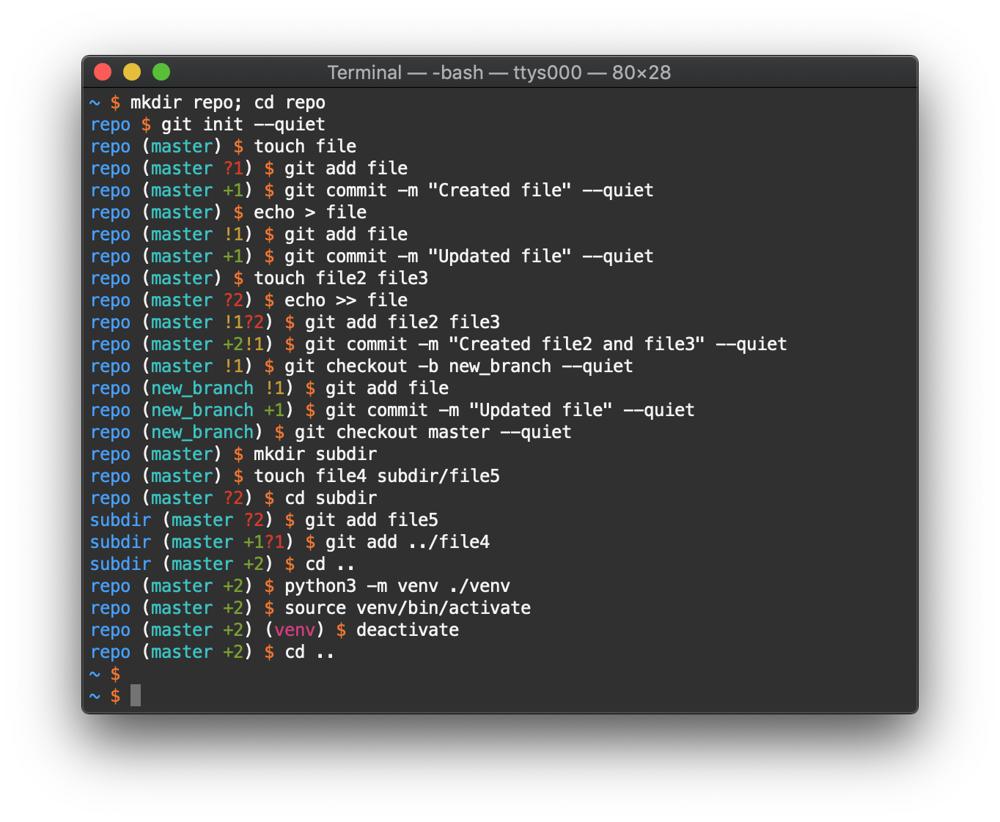

git-venv-prompt
===============

A Bash prompt that shows Git and Python virtual environment information in color.

Features
--------

The prompt can be read as follows:

* The current directory name is displayed in blue
* If the current directory is part of a Git repository, the prompt will show

  * the current branch name in cyan;
  * the number of staged files (if any) indicated by ``+`` in green;
  * the number of modified files (if any) indicated by ``!`` in yellow;
  * the number of untracked files (if any) indicated by ``?`` in red.

* If a Python virtual environment is activated, its root directory name will be indicated in magenta.

Usage
-----

Download the script `git_venv_prompt.sh <git_venv_prompt.sh>`__ to your home directory and add the following line to your ~/.bashrc or ~/.bash_profile file:

.. code:: shell

  source ~/git_venv_prompt.sh
